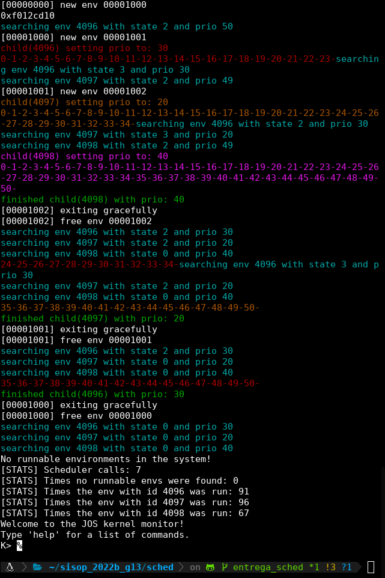

# SCHED.md (WIP)

Lugar para respuestas en prosa, seguimientos con GDB y documentación del TP

## Tabla de Contenidos

- [Seguimiento con GDB](#seguimiento-con-gdb)
- [Schedulers](#schedulers)
- [Ejemplo del Scheduler con Prioridades](#ejemplo-del-scheduler-con-prioridades)
- [Macros en el Makefile](#macros-en-el-makefile)

## Seguimiento con GDB

Ejecutamos el programa con gdb. Dejamos un break en la función [`context_switch`](kern/switch.S) y mostramos el estado de los registros.

```console
(gdb) break context_switch 
Breakpoint 1 at 0xf01042f5: file kern/switch.S, line 10.
(gdb) c
Continuing.
The target architecture is set to "i386".
=> 0xf01042f5 <context_switch>:	mov    0x8(%ebp),%esp

Breakpoint 1, context_switch () at kern/switch.S:10
10		movl 0x8(%ebp), %esp
(gdb) list
5	 * This function does not return.
6	 */
7	
8	.globl context_switch;
9	context_switch:
10		movl 0x8(%ebp), %esp
11		popal
12		popl %es
13		popl %ds
14		addl $0x8, %esp
(gdb) info registers
eax            0x0                 0
ecx            0xf01253c0          -267234368
edx            0xef803000          -276811776
ebx            0xf02b4000          -265601024
esp            0xf0123f8c          0xf0123f8c
ebp            0xf0123fa8          0xf0123fa8
esi            0x2                 2
edi            0xf02b4000          -265601024
eip            0xf01042f5          0xf01042f5 <context_switch>
eflags         0x46                [ IOPL=0 ZF PF ]
cs             0x8                 8
ss             0x10                16
ds             0x10                16
es             0x10                16
fs             0x23                35
gs             0x23                35
fs_base        0x0                 0
gs_base        0x0                 0
k_gs_base      0x0                 0
cr0            0x80050033          [ PG AM WP NE ET MP PE ]
cr2            0x0                 0
cr3            0x3bb000            [ PDBR=955 PCID=0 ]
cr4            0x10                [ PSE ]
cr8            0x0                 0
efer           0x0                 [ ]
```

Y seguiremos ejecutando instrucción por instrucción, mostrando el estado de los registros paso a paso.

```console
(gdb) n
=> 0xf01042f8 <context_switch+3>:	popa   
context_switch () at kern/switch.S:11
11		popal
(gdb) info registers
eax            0x0                 0
ecx            0xf01253c0          -267234368
edx            0xef803000          -276811776
ebx            0xf02b4000          -265601024
esp            0xf02b4000          0xf02b4000
ebp            0xf0123fa8          0xf0123fa8
esi            0x2                 2
edi            0xf02b4000          -265601024
eip            0xf01042f8          0xf01042f8 <context_switch+3>
eflags         0x46                [ IOPL=0 ZF PF ]
cs             0x8                 8
ss             0x10                16
ds             0x10                16
es             0x10                16
fs             0x23                35
gs             0x23                35
fs_base        0x0                 0
gs_base        0x0                 0
k_gs_base      0x0                 0
cr0            0x80050033          [ PG AM WP NE ET MP PE ]
cr2            0x0                 0
cr3            0x3bb000            [ PDBR=955 PCID=0 ]
cr4            0x10                [ PSE ]
cr8            0x0                 0
efer           0x0                 [ ]
```

```console
(gdb) n
=> 0xf01042f9 <context_switch+4>:	pop    %es
context_switch () at kern/switch.S:12
12		popl %es
(gdb) info registers
eax            0x0                 0
ecx            0x0                 0
edx            0x0                 0
ebx            0x0                 0
esp            0xf02b4020          0xf02b4020
ebp            0x0                 0x0
esi            0x0                 0
edi            0x0                 0
eip            0xf01042f9          0xf01042f9 <context_switch+4>
eflags         0x46                [ IOPL=0 ZF PF ]
cs             0x8                 8
ss             0x10                16
ds             0x10                16
es             0x10                16
fs             0x23                35
gs             0x23                35
fs_base        0x0                 0
gs_base        0x0                 0
k_gs_base      0x0                 0
cr0            0x80050033          [ PG AM WP NE ET MP PE ]
cr2            0x0                 0
cr3            0x3bb000            [ PDBR=955 PCID=0 ]
cr4            0x10                [ PSE ]
cr8            0x0                 0
efer           0x0                 [ ]
```

```console
(gdb) n
=> 0xf01042fa <context_switch+5>:	pop    %ds
13		popl %ds
(gdb) info registers
eax            0x0                 0
ecx            0x0                 0
edx            0x0                 0
ebx            0x0                 0
esp            0xf02b4024          0xf02b4024
ebp            0x0                 0x0
esi            0x0                 0
edi            0x0                 0
eip            0xf01042fa          0xf01042fa <context_switch+5>
eflags         0x46                [ IOPL=0 ZF PF ]
cs             0x8                 8
ss             0x10                16
ds             0x10                16
es             0x23                35
fs             0x23                35
gs             0x23                35
fs_base        0x0                 0
gs_base        0x0                 0
k_gs_base      0x0                 0
cr0            0x80050033          [ PG AM WP NE ET MP PE ]
cr2            0x0                 0
cr3            0x3bb000            [ PDBR=955 PCID=0 ]
cr4            0x10                [ PSE ]
cr8            0x0                 0
efer           0x0                 [ ]
```

```console
(gdb) n
=> 0xf01042fb <context_switch+6>:	add    $0x8,%esp
14		addl $0x8, %esp
(gdb) info registers
eax            0x0                 0
ecx            0x0                 0
edx            0x0                 0
ebx            0x0                 0
esp            0xf02b4028          0xf02b4028
ebp            0x0                 0x0
esi            0x0                 0
edi            0x0                 0
eip            0xf01042fb          0xf01042fb <context_switch+6>
eflags         0x46                [ IOPL=0 ZF PF ]
cs             0x8                 8
ss             0x10                16
ds             0x23                35
es             0x23                35
fs             0x23                35
gs             0x23                35
fs_base        0x0                 0
gs_base        0x0                 0
k_gs_base      0x0                 0
cr0            0x80050033          [ PG AM WP NE ET MP PE ]
cr2            0x0                 0
cr3            0x3bb000            [ PDBR=955 PCID=0 ]
cr4            0x10                [ PSE ]
cr8            0x0                 0
efer           0x0                 [ ]
```

```console
(gdb) n
=> 0xf01042fe <context_switch+9>:	iret   
15		iret
(gdb) info registers
eax            0x0                 0
ecx            0x0                 0
edx            0x0                 0
ebx            0x0                 0
esp            0xf02b4030          0xf02b4030
ebp            0x0                 0x0
esi            0x0                 0
edi            0x0                 0
eip            0xf01042fe          0xf01042fe <context_switch+9>
eflags         0x96                [ IOPL=0 SF AF PF ]
cs             0x8                 8
ss             0x10                16
ds             0x23                35
es             0x23                35
fs             0x23                35
gs             0x23                35
fs_base        0x0                 0
gs_base        0x0                 0
k_gs_base      0x0                 0
cr0            0x80050033          [ PG AM WP NE ET MP PE ]
cr2            0x0                 0
cr3            0x3bb000            [ PDBR=955 PCID=0 ]
cr4            0x10                [ PSE ]
cr8            0x0                 0
efer           0x0                 [ ]
```

Ejecutamos el `iret`:

```console
(gdb) n
=> 0x800020:	cmp    $0xeebfe000,%esp
0x00800020 in ?? ()
(gdb) info registers
eax            0x0                 0
ecx            0x0                 0
edx            0x0                 0
ebx            0x0                 0
esp            0xeebfe000          0xeebfe000
ebp            0x0                 0x0
esi            0x0                 0
edi            0x0                 0
eip            0x800020            0x800020
eflags         0x202               [ IOPL=0 IF ]
cs             0x1b                27
ss             0x23                35
ds             0x23                35
es             0x23                35
fs             0x23                35
gs             0x23                35
fs_base        0x0                 0
gs_base        0x0                 0
k_gs_base      0x0                 0
cr0            0x80050033          [ PG AM WP NE ET MP PE ]
cr2            0x0                 0
cr3            0x3bb000            [ PDBR=955 PCID=0 ]
cr4            0x10                [ PSE ]
cr8            0x0                 0
efer           0x0                 [ ]
```

## Schedulers

Actualmente existen dos schedulers implementados. Se puede decidir cual usar en función de la macro indicada en la sección de macros. 

```c
#ifndef PRIORITY_SCHEDULER  // Priority Scheduler
	int maxPriority = -1;
	struct Env *maxPriorityEnv = NULL;
	for (struct Env *i = envs; i < envs + NENV; i++) {

		if (i->env_status == ENV_RUNNABLE &&
		    i->env_priority >= maxPriority) {
			maxPriority = i->env_priority;
			maxPriorityEnv = i;
		}
	}
	if (maxPriority > 0) {
		env_run(maxPriorityEnv);
	} else if (curenv && curenv->env_status == ENV_RUNNING) {
		no_runnable_envs_found++;
		env_run(curenv);
	}
#else  // RR
	struct Env *idle = (curenv) ? curenv + 1 : envs;

	for (; idle < envs + NENV; idle++) {
		if (idle->env_status == ENV_RUNNABLE) {
			env_run(idle);
		}
	}

	idle = envs;
	for (; idle < curenv; idle++) {
		if (idle->env_status == ENV_RUNNABLE) {
			env_run(idle);
		}
	}

	if (curenv && curenv->env_status == ENV_RUNNING) {
		no_runnable_envs_found++;
		env_run(curenv);
	}
#endif
	sched_halt();
```

El scheduler _round robin_, como indica el hint que predocumentaba la función, comienza a iterar linealmente los `envs` de forma circular desde el `curenv`. Si encuentra un `env` que pueda ser ejecutado (estado `RUNNABLE`), lo envía a `env_run` la cual corta la ejecución del scheduler y efectivamente lo ejecuta. 

En cambio el scheduler por prioridad, utiliza la propiedad `env_priority` añadida. Esta modela actualmente la prioridad como un número entero entre 0 y 100. Siendo 100 la mejor prioridad de ejecución. Este algoritmo busca de manera lineal el `env` en estado ejecutable que pueda maximizar la prioridad y lo ejecuta.

En ambos casos, si al final no se encuentra un `env` ejecutable, se ejecuta el `curenv` actual. Si este no existe o si no está en estado `RUNNABLE`, se pausa el CPU.

## Ejemplo del Scheduler con Prioridades

En el archivo [`testprios.c`](user/testprios.c) se muestra un ejemplo de un programa con varios forks el cual demuestra la utilización del scheduler con prioridades. El `umain` ejecuta:

```c
void
umain(int argc, char **argv) {
    int i = fork();
    if (i > 0) {
       parent_p1();
    } else if (i == 0) {
        int j = fork();
        if (j > 0) {
            child_p2();
        } else if (j == 0) {
            grandchild_p3();
        } else if (j < 0) {
            panic("fork failed");
        }
    } else if (i < 0) {
        panic("fork failed");
    }
}
```

El cual genera 3 procesos. Vemos que el proceso 1 empieza con prioridad 50 (pues en `env_alloc` decidimos crear todos los procesos con una prioridad default de 50) y los otros dos procesos con prioridad 49 (pues en `fork` los iniciamos con prioridad 50 - 1). Ejecutando el mismo en [modo debug](#macros-en-el-makefile) podemos ver como el output del programa en la consola:

<p align="center"></p>

Primero vemos como el proceso padre (envid 4096) comienza, como dijimos, con prioridad 50. Se realiza la llamada a la syscall para disminuir la prioridad del mismo a 30 y se ejecuta al mismo un slice de tiempo. 

Viendo el codigo del padre, en un momento se cansa de iterar y quiere ir mas rápido subiendo su propia prioridad:

```c
for (int j = 0; j <= 100; j++) {
	cprintf(RED_COLOR"%d-"RESET, j);
	if (j == 20) {
		sys_env_set_priority(
			thisenv->env_id,
			90
		); // This is boring, lets go faster! 
	}
}
```

Vemos que esto jamás ocurre pues en posteriores búsquedas con este `envid` no se encuentran entradas con una prioridad mas elevada. Esto ocurre debido a que nuestro kernel no le permite a los procesos de usuario elevar sus propias prioridades.

Luego vemos dos lineas de texto celeste. Estas corresponden a:

```c
#ifdef HARD_DEBUG
		if (i->env_id != 0)
			cprintf(CYAN_COLOR "searching env %d with state %d and "
			                   "prio %d\n" RESET,
			        i->env_id,
			        i->env_status,
			        i->env_priority);
#endif
```

Dentro del archivo [`sched.c`](kern/sched.c) en el scheduler de prioridades. Nos permiten ver como se van buscando los procesos para correr dentro del scheduler.

Notamos que encuentra al proceso padre y al hijo. El primero en estado 3 (RUNNING) y el segundo en estado 2 (RUNNABLE). Esto implica que se procedera a ejecutar al proceso hijo.

Ajustamos su prioridad a 20 y se ejecuta un tiempo. Ocurre el context switch y se ejecuta el scheduler. Esta vez el proceso hijo esta marcado como RUNNING, por lo que tenemos que elegir entre el padre y el nieto. Como el nieto tiene una prioridad mayor al padre, se ejecuta el nieto. Este decide reajustar su prioridad a 40 y se ejecuta hasta el final.

Luego el scheduler detecta que el mismo esta en estado FREE y procede a elegir entre el padre y el hijo. Como el hijo tiene una prioridad menor al padre ejecuta al padre. 

Finalmente van alternando sus ejecuciones hasta que al final ambos terminan y se termina la ejecucion para entrar en modo monitor.

## Macros en el Makefile

De querer ejecutar el modo `HARD_DEBUG` se debe descomentar la linea 94 en el [Makefile](GNUmakefile). Esto causará que al ejecutar nuestro programa, se impriman lineas correspondientes a que eventos estan siendo buscados por el scheduler de prioridades junto con las estadísticas finales.

Otra macro utilizada es el `USE_PRIORITY_SCHEDULER`. El mismo esta en la linea 95 del [Makefile](GNUmakefile). En nuestra implementacion utilizamos por default el algoritmo de round robin. Para utilizar el algoritmo de prioridades, debemos descomentar esta linea y volver a compilar el programa. De esta manera el `ifdef USE_PRIORITY_SCHEDULER` será verdadero y se ejecutará el scheduler de prioridades.
